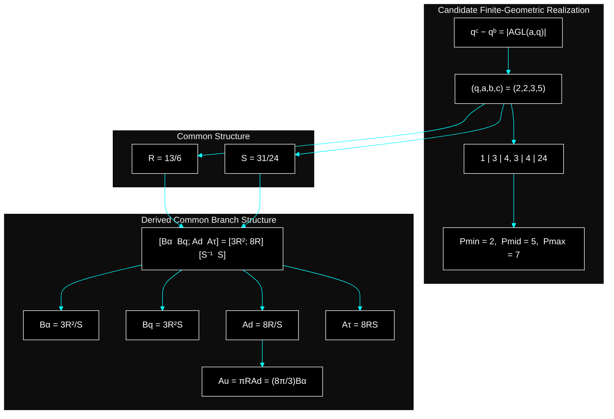
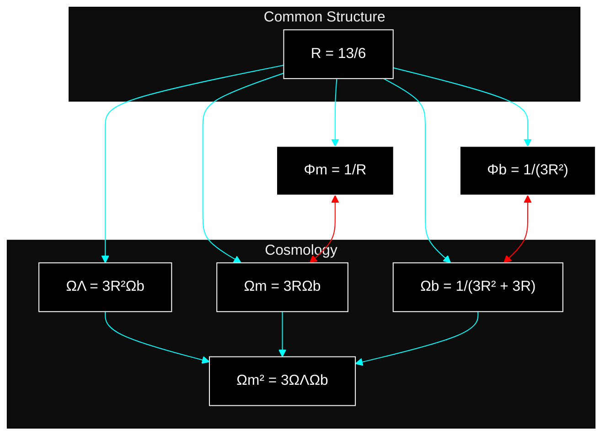
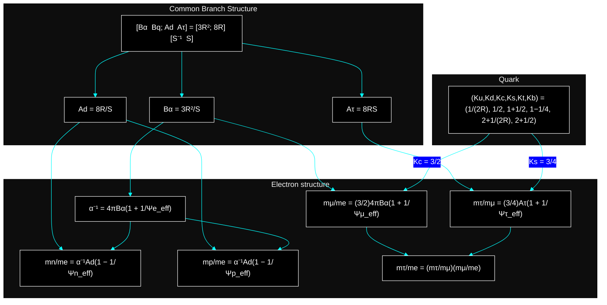
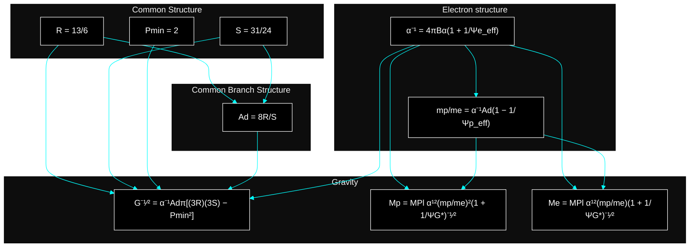
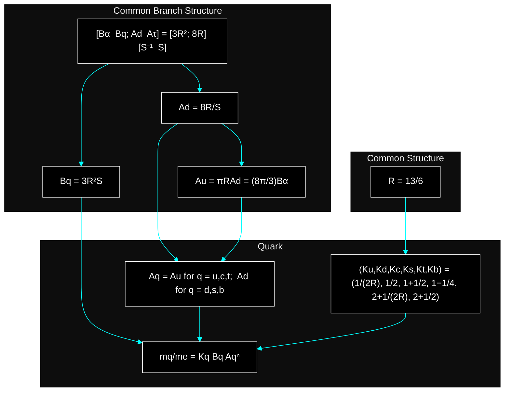
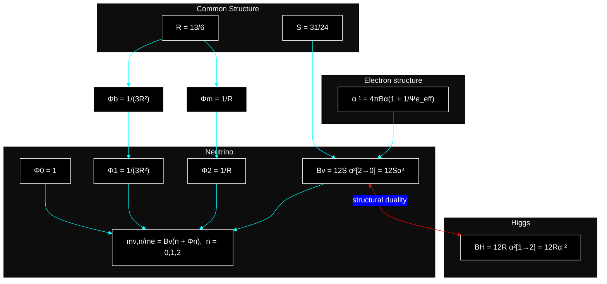
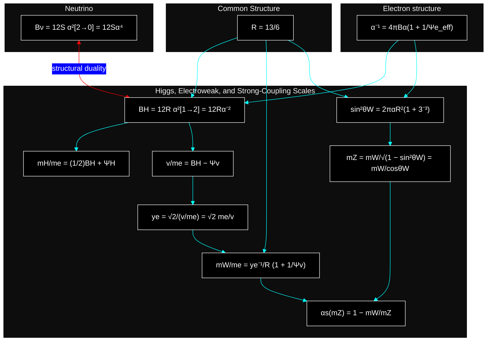
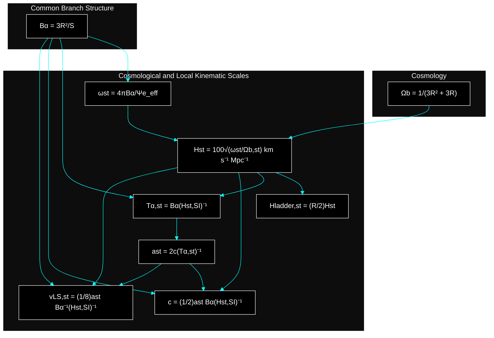

# Zero Parameter Structure

No free parameters. No tuning. Only structure.

[](https://colab.research.google.com/github/yasuotanakaresearch/zero-parameter-structure/blob/main/example.ipynb)

Run the complete end-to-end notebook directly in a web browser without installing Python or Jupyter locally.

---

## Can this really be computed from just a few lines?

```python
from fractions import Fraction
import math

me_c2 = 0.510998950690048  # MeV, electron-sector structural value

R = Fraction(13, 6)
S = Fraction(31, 24)

# Cosmology
Omega_b = 1 / (3 * R**2 + 3 * R)
Omega_m = 3 * R * Omega_b
Omega_L = 3 * R**2 * Omega_b
Omega_dm = Omega_m - Omega_b

# Quark Masses
K_q = {
    "u": (    1 / (2 * R)),
    "d": (    1 /  2),
    "c": (1 + 1 /  2),
    "s": (1 - 1 /  4),
    "t": (2 + 1 / (2 * R)),
    "b": (2 + 1 /  2),
}

B_q = (3 * R**2) * S
A_d = (8 * R) / S
A_u = math.pi * R * A_d

m_u = me_c2 * K_q["u"] * B_q
m_d = me_c2 * K_q["d"] * B_q
m_c = me_c2 * K_q["c"] * B_q * A_u
m_s = me_c2 * K_q["s"] * B_q * A_d
m_t = me_c2 * K_q["t"] * B_q * A_u**2 * 10**-3  # GeV
m_b = me_c2 * K_q["b"] * B_q * A_d**2 * 10**-3  # GeV

print("Cosmology")
print(f"Omega_L  = {float(Omega_L):.12f} = {Omega_L}")
print(f"Omega_m  = {float(Omega_m):.12f} = {Omega_m}")
print(f"Omega_dm = {float(Omega_dm):.12f} = {Omega_dm}")
print(f"Omega_b  = {float(Omega_b):.12f} = {Omega_b}")
print()
print("Quark Masses")
print("mu =", m_u, "MeV")
print("md =", m_d, "MeV")
print("mc =", m_c, "MeV")
print("ms =", m_s, "MeV")
print("mt =", m_t, "GeV")
print("mb =", m_b, "GeV")
```

```text
Cosmology
Omega_L  = 0.684210526316 = 13/19
Omega_m  = 0.315789473684 = 6/19
Omega_dm = 0.267206477733 = 66/247
Omega_b  = 0.048582995951 = 12/247

Quark Masses
mu = 2.1451310117507294 MeV
md = 4.647783858793247 MeV
mc = 1273.6226956581245 MeV
ms = 93.55539122216084 MeV
mt = 173.01262181563263 GeV
mb = 4.184843306281603 GeV
```

No fitting.  
No free parameters.  
Only structure.

---

## Overview

This repository presents a minimal structural framework in which selected physical quantities are examined through fixed dimensionless ratios rather than parameter fitting.

The common inputs are the fixed `R`- and `S`-branches:

```math
R = \frac{13}{6},
\qquad
S = \frac{31}{24}.
```

In Version 3 of the foundational note, these ratios are no longer introduced only through the earlier path-count representation. A candidate finite-geometric realization is added in which the shell-symmetry condition

```math
q^c-q^b
=
\left|\mathrm{AGL}(a,q)\right|,
\qquad
1\le a<b<c,
```

uniquely selects

```math
(q,a,b,c)=(2,2,3,5).
```

The same binary structure produces the nonzero-state counts `3`, `7`, and `31`, the layer decomposition `3 | 4 | 24`, and the fixed structural ratios used throughout the repository.

These branches are carried unchanged across cosmological density relations, electromagnetic coupling, charged-particle mass hierarchy, gravity-sector relations, quark-mass hierarchy, neutrino mass relations, Higgs, electroweak, Yukawa, and strong-coupling scale relations, and cosmological and local kinematic scales.

The repository provides reproducible Python implementations and paper-level numerical comparisons for the **Structural Origin of** series.

---

## Research Concept

The framework separates three levels explicitly:

1. minimal structural assumptions,
2. a candidate finite-geometric realization,
3. sector-specific physical relations constructed from the resulting fixed ratios.

The finite-geometric realization uses the unique solution

```math
(q,a,b,c)=(2,2,3,5)
```

of the shell-symmetry condition above. In the binary realization,

```math
\mathbb{F}_2^2
\subset
\mathbb{F}_2^3
\subset
\mathbb{F}_2^5,
```

the state counts are fixed rather than fitted. The ratios `R` and `S` are then interpreted as common structural ratios generated within this realization.

This finite geometry is used as a structural representation; it is not identified with physical spacetime and does not replace standard general relativity or quantum field theory. The causal interpretation of the framework is intended to remain compatible with standard relativistic causal structure.

The same fixed branches are carried unchanged across different sectors:

- cosmological density relations
- electromagnetic coupling and charged-particle mass hierarchy
- gravity-sector structural relations
- quark-mass hierarchy
- neutrino mass relations
- Higgs, electroweak, Yukawa, and strong-coupling scale relations
- cosmological and local kinematic scales

The central question is whether a common fixed structure can organize numerical relations across particle physics, gravity, and cosmology without observable-by-observable tuning.

For the full research position, assumptions, scope, and limitations, see [CONCEPT.md](CONCEPT.md).

---

## Key Principle

Physical quantities are not adjusted individually to data.  
They are reconstructed from a common fixed structure.

- No adjustable parameters
- No observable-specific fitting
- Fully reproducible relations
- Direct numerical comparison with observation
- Common structural rules across physical categories

---

## Common Structural Definitions

### Finite-geometric backbone

Version 3 of the foundational note uses a candidate finite-geometric realization in which

```math
q^c-q^b
=
\left|\mathrm{AGL}(a,q)\right|,
\qquad
1\le a<b<c.
```

The unique finite-field and dimension solution is

```math
(q,a,b,c)=(2,2,3,5).
```

The corresponding nested binary spaces are

```math
\mathbb{F}_2^2
\subset
\mathbb{F}_2^3
\subset
\mathbb{F}_2^5.
```

For the first inclusion,

```math
\mathbb{F}_2^3
=
\{0\}
\sqcup
\left(\mathbb{F}_2^2\setminus\{0\}\right)
\sqcup
\left(\mathbb{F}_2^3\setminus\mathbb{F}_2^2\right),
```

with cardinalities

```math
1\,|\,3\,|\,4.
```

This gives the legacy structural interface in the form

```math
P_{\min}=1+1=2,
\qquad
P_{\mathrm{mid}}=1+4=5,
\qquad
P_{\max}=3+4=7.
```

The earlier identity

```math
P_{\mathrm{mid}}
=
P_{\max}-P_{\min}
=
5
```

remains numerically valid, but is treated as a compatibility identity rather than the defining relation for `P_mid`.

The higher binary space gives

```math
2^5-1=31,
\qquad
2^3-1=7,
\qquad
2^5-2^3=24.
```

The ratio `S` is the total-to-outer-shell normalization

```math
S
=
\frac{2^5-1}{2^5-2^3}
=
\frac{31}{24}.
```

The ratio `R` is the unique common value of the projective-incidence and affine-action normalizations at `q=2`:

```math
R
=
2+\frac{1}{q(q+1)}
=
\frac{13}{6}.
```

The earlier forms are recovered exactly:

```math
R
=
2\left(1+\frac{P_{\min}}{24}\right)
=
\frac{13}{6},
\qquad
S
=
1+\frac{P_{\max}}{24}
=
\frac{31}{24}.
```

Thus the existing sector-level interface is preserved while the foundational construction is strengthened.

### Derived common branch structure

The four common branch quantities are defined compactly by

```math
\begin{pmatrix}
B_{\alpha} & B_q \\
A_d & A_{\tau}
\end{pmatrix}
=
\begin{pmatrix}
3R^2 \\
8R
\end{pmatrix}
\begin{pmatrix}
S^{-1} & S
\end{pmatrix}.
```

Expanding the matrix gives

```math
B_{\alpha}=\frac{3R^2}{S},
\qquad
B_q=3R^2S,
\qquad
A_d=\frac{8R}{S},
\qquad
A_{\tau}=8RS.
```

The factorization implies

```math
\frac{B_q}{B_{\alpha}}
=
\frac{A_{\tau}}{A_d}
=
S^2,
\qquad
B_{\alpha}A_{\tau}
=
B_qA_d
=
24R^3.
```

The up-branch amplification factor can be written in either form

```math
A_u
=
\pi R A_d
=
\frac{8\pi R^2}{S}
=
\frac{8\pi}{3}B_{\alpha}.
```

These branch quantities are derived algebraic descendants of `R` and `S`, not additional independent structural inputs. They provide the common interface to the sector-specific relations below.

**Structure map — Finite-Geometric and Common Branch Structure**



---

## Current Scope (Public)

The current public release includes:

- Cosmological density relations
- Reconstruction of `ΩΛ`, `Ωm`, `Ωdm`, and `Ωb`
- Electromagnetic coupling and charged-particle mass hierarchy
- Gravity-sector structural relations
- Quark-mass hierarchy
- Neutrino mass relations
- Higgs, electroweak, Yukawa, and strong-coupling scale relations
- Cosmological and local kinematic scales

### Cosmology

The density parameters are generated from the same structural ratio `R`:

```math
\Omega_b = \frac{1}{3R^2+3R},
\qquad
\Omega_m = 3R\Omega_b,
\qquad
\Omega_\Lambda = 3R^2\Omega_b,
\qquad
\Omega_{dm} = \Omega_m - \Omega_b.
```

These relations imply the compact consistency relation

```math
\Omega_m^2 = 3\Omega_\Lambda\Omega_b.
```

**Structure map — Cosmological Density Structure**



### Electromagnetic Coupling and Mass Hierarchy

The effective structural indices are generated from the common structural values above through fixed backbone values and residual structural corrections.

The backbone values are

```math
\Psi_{e0}
=
\left(
\frac{3}{2}
\right)
\frac{13\cdot31^2-P_{\max}^2}{3},
\qquad
\Psi_{p0}
=
\left(
\frac{3}{2}
\right)
\frac{13^2\cdot31+P_{\max}^2}{12},
```

```math
\Psi_{n0}
=
\left(
\frac{3}{2}
\right)
\left(
13\cdot31+P_{\min}^2
\right)12,
\qquad
\Psi_{\mu0}
=
\frac{\Psi_{p0}}{P_{\min}^2},
\qquad
\Psi_{\tau0}
=
\Psi_{p0}.
```

The residual structural corrections are

```math
\delta_e
=
\frac{1}{2}
+
\frac{1}{P_{\mathrm{mid}}^2},
\qquad
\delta_p
=
\frac{6^2}
{\Psi_{e0}+24-\frac{1}{2}},
\qquad
\delta_n
=
\left(
\frac{2}{3}
\right)
\frac{12P_{\max}-1}
{12P_{\max}+3},
```

```math
\delta_\mu
=
\frac{1}{2}
-
\frac{1}{P_{\max}^2}
+
\frac{1}
{\Psi_{\mu0}P_{\max}^2},
\qquad
\delta_\tau=1.
```

The effective indices are therefore

```math
\Psi_e^{\mathrm{eff}}
=
\Psi_{e0}-\delta_e,
\qquad
\Psi_p^{\mathrm{eff}}
=
\Psi_{p0}+\delta_p,
\qquad
\Psi_n^{\mathrm{eff}}
=
\Psi_{n0}-\delta_n,
```

```math
\Psi_\mu^{\mathrm{eff}}
=
\Psi_{\mu0}-\delta_\mu,
\qquad
\Psi_\tau^{\mathrm{eff}}
=
\Psi_{\tau0}+\delta_\tau.
```

The inverse electromagnetic coupling is then

```math
\alpha^{-1}
=
4\pi B_{\alpha}
\left(
1+\frac{1}{\Psi_e^{\mathrm{eff}}}
\right).
```

The charged-particle mass ratios are then written as

```math
\frac{m_p}{m_e}
=
\alpha^{-1}A_d
\left(
1-\frac{1}{\Psi_p^{\mathrm{eff}}}
\right),
\qquad
\frac{m_n}{m_e}
=
\alpha^{-1}A_d
\left(
1-\frac{1}{\Psi_n^{\mathrm{eff}}}
\right),
```

```math
\frac{m_\mu}{m_e}
=
\left(
\frac{3}{2}
\right)
4\pi B_{\alpha}
\left(
1+\frac{1}{\Psi_\mu^{\mathrm{eff}}}
\right),
\qquad
\frac{m_\tau}{m_\mu}
=
\left(
\frac{3}{4}
\right)
A_{\tau}
\left(
1+\frac{1}{\Psi_\tau^{\mathrm{eff}}}
\right),
```

with

```math
\frac{m_\tau}{m_e}
=
\frac{m_\tau}{m_\mu}
\frac{m_\mu}{m_e}.
```

The electron mass-energy scale is obtained from the structural mass path

```math
\Psi_{m_e}^{*}
=
24\left[
\frac{3}{2}RS(6\cdot24)-1
\right],
\qquad
\Psi_{m_e}
=
12\Psi_{m_e}^{*}
+
\frac{\Psi_{e0}}{3},
```

```math
m_e c^2
=
\frac{(c/10^3)^2}
{\Psi_{m_e}\left[1+(\Psi_{m_e}^{*})^{-2}\right]} 10^{-6}
\ \mathrm{MeV}.
```

**Structure map — Electromagnetic and Charged-Particle Structure**



### Gravity

The gravity-sector structural indices are

```math
\Psi_G
=
8R
\left[
(3R)(3S)-P_{\min}^2
\right],
\qquad
\Psi_{G0}
=
RS^2(12\cdot24),
```

```math
\Psi_G^{*}
=
4\Psi_G
-
3\left(
1+\frac{1}{\Psi_{G0}}
\right).
```

Using the inherited electromagnetic coupling and the common branch

```math
A_d=\frac{8R}{S},
```

the gravitational relation is written as

```math
G^{-1/2}
=
\alpha^{-1}
A_d
\pi
\left[
(3R)(3S)-P_{\min}^2
\right].
```

Equivalently,

```math
\sqrt{G}
=
\left\{
\alpha^{-1}
A_d
\pi
\left[
(3R)(3S)-P_{\min}^2
\right]
\right\}^{-1},
\qquad
G=(\sqrt{G})^2.
```

The SI mass scales are connected through

```math
M_{\mathrm{Pl}}
=
\sqrt{\frac{\hbar c}{G}},
```

```math
M_p
=
M_{\mathrm{Pl}}
\alpha^{12}
\left(
\frac{m_p}{m_e}
\right)^2
\left(
1+\frac{1}{\Psi_G^{*}}
\right)^{-1/2},
```

```math
M_e
=
M_{\mathrm{Pl}}
\alpha^{12}
\left(
\frac{m_p}{m_e}
\right)
\left(
1+\frac{1}{\Psi_G^{*}}
\right)^{-1/2}.
```

**Structure map — Gravity-Sector Inheritance**



### Quark Masses

The quark masses are generated by the unified relation

```math
\frac{m_q}{m_e}
=
K_q B_q A_q^{n_q},
\qquad
B_q = 3R^2S.
```

The branch amplification factors are

```math
A_q =
\begin{cases}
A_u & (q=u,c,t), \\
A_d & (q=d,s,b),
\end{cases}
\qquad
A_d = \frac{8R}{S},
\qquad
A_u = \pi R A_d.
```

Equivalently,

```math
A_d = \frac{8R}{S},
\qquad
A_u = \frac{8\pi R^2}{S}
= \frac{8\pi}{3}B_{\alpha}.
```

Here, $A_d$ is the down-branch amplification factor. Its additional appearance in the proton and neutron relations above is treated as the same quark-sector structural connection at the common nucleon scale, rather than as a constituent-counting rule.

The structural coefficients are written directly as

```math
(K_u,K_d,K_c,K_s,K_t,K_b)
=
\left(
\frac{1}{2R},\,
\frac{1}{2},\,
1+\frac{1}{2},\,
1-\frac{1}{4},\,
2+\frac{1}{2R},\,
2+\frac{1}{2}
\right).
```

The generation index is

```math
n_q =
\begin{cases}
0 & (u,d), \\
1 & (c,s), \\
2 & (t,b).
\end{cases}
```

**Structure map — Quark Mass Branch Structure**



### Neutrino Masses

Using the structural-transfer notation

```math
\alpha^2_{[i\to j]}
=
\alpha^{2(i-j)},
```

the common neutrino base structure is

```math
B_\nu
=
12S\alpha^2_{[2\to0]}
=
12S\alpha^4.
```

The three neutrino mass ratios are generated by the unified relation

```math
\frac{m_{\nu,n}}{m_e}
=
B_\nu(n+\Phi_n),
\qquad
n=0,1,2,
```

with fixed branch factors

```math
\Phi_0=1,
\qquad
\Phi_1=\frac{1}{3R^2},
\qquad
\Phi_2=\frac{1}{R}.
```

The displayed labels $m_{\nu1}$, $m_{\nu2}$, and $m_{\nu3}$
correspond respectively to $n=0,1,2$.  The mass-squared differences are

```math
\Delta m_{21}^2
=
m_{\nu2}^2-m_{\nu1}^2,
\qquad
\Delta m_{31}^2
=
m_{\nu3}^2-m_{\nu1}^2,
\qquad
\Delta m_{32}^2
=
m_{\nu3}^2-m_{\nu2}^2,
```

```math
\sum m_\nu
=
m_{\nu1}+m_{\nu2}+m_{\nu3}.
```

**Structure map — Neutrino Mass Structure and Higgs Duality**



### Higgs, Electroweak, and Strong-Coupling Scales

The Higgs-sector base structure is

```math
B_H
=
12R\alpha^2_{[1\to2]}
=
12R\alpha^{-2}.
```

The Higgs mass and electroweak vacuum expectation value are represented by

```math
\frac{m_H}{m_e}
=
\frac{1}{2}B_H+\Psi_H,
\qquad
\frac{v}{m_e}
=
B_H-\Psi_v,
```

The Higgs-sector structural indices are generated directly from the common branch ratio \(R\):

```math
\Psi_H
=
12\left[
4(3R^2)+3
\right]
=
712,
\qquad
\Psi_v
=
3^2\Psi_H
=
6408.
```

The electron Yukawa coupling follows from the vacuum-scale ratio:

```math
 y_e
 =
 \frac{\sqrt{2}}{v/m_e}
 =
 \frac{\sqrt{2}\,m_e}{v}.
```

The weak mixing relation is

```math
\sin^2\theta_W
=
2\pi\alpha R^2
\left(
1+3^{-3}
\right),
\qquad
\cos\theta_W
=
\sqrt{1-\sin^2\theta_W}.
```

The \(W\)-boson mass ratio and physical mass scale are

```math
\frac{m_W}{m_e}
=
\frac{y_e^{-1}}{R}
\left(
1+\frac{1}{\Psi_v}
\right).
```

The \(Z\)-boson mass is then

```math
m_Z
=
\frac{m_W}{\cos\theta_W}.
```

Finally, the structural boundary value of the strong coupling is

```math
\alpha_s(m_Z)
=
1-\frac{m_W}{m_Z}.
```

**Structure map — Higgs, Electroweak, and Strong-Coupling Structure**



### Cosmological and Local Kinematic Scales

Using the common branch scale $B_{\alpha}$ and the inherited effective electron index,
the physical baryon density parameter and structural Hubble scale are written as

```math
\Omega_{b,\mathrm{st}}
=
\frac{1}{3R^2+3R},
\qquad
\omega_{\mathrm{st}}
=
\frac{4\pi B_{\alpha}}
{\Psi_e^{\mathrm{eff}}},
```

```math
H_{\mathrm{st}}
=
100
\sqrt{
\frac{\omega_{\mathrm{st}}}
{\Omega_{b,\mathrm{st}}}
}
\ \mathrm{km\,s^{-1}\,Mpc^{-1}}.
```

The corresponding local distance-ladder scale is

```math
H_{\mathrm{ladder,st}}
=
\left(
\frac{R}{2}
\right)
H_{\mathrm{st}}.
```

For the time, acceleration, closure, and velocity relations,
$H_{\mathrm{st}}$ is first converted to SI units:

```math
H_{\mathrm{st}}^{\mathrm{SI}}
=
H_{\mathrm{st}}
\frac{10^3}{\mathrm{Mpc}}
\ \mathrm{s^{-1}}.
```

The structural time and acceleration scales are then

```math
T_{\alpha,\mathrm{st}}
=
B_{\alpha}
\left(
H_{\mathrm{st}}^{\mathrm{SI}}
\right)^{-1},
\qquad
a_{\mathrm{st}}
=
2c
T_{\alpha,\mathrm{st}}^{-1}.
```

The speed-of-light closure relation is

```math
c
=
\frac{1}{2}
a_{\mathrm{st}}
B_{\alpha}
\left(
H_{\mathrm{st}}^{\mathrm{SI}}
\right)^{-1}.
```

The corresponding Local Sheet velocity scale is

```math
v_{\mathrm{LS,st}}
=
\frac{1}{8}
a_{\mathrm{st}}
B_{\alpha}^{-1}
\left(
H_{\mathrm{st}}^{\mathrm{SI}}
\right)^{-1}.
```

**Structure map — Cosmological and Local Kinematic Structure**



---

## Theory vs Observation Summary

Representative comparisons between structural predictions and observed reference values.  
Detailed numerical outputs are reproduced by running the corresponding paper scripts.

### Cosmology

| Quantity | Theory | Observation | Difference |
|---|---:|---:|---:|
| $\Omega_\Lambda$ | 0.68421053 | 0.68500000 | -0.079 %-pt |
| $\Omega_m$ | 0.31578947 | 0.31500000 | +0.079 %-pt |
| $\Omega_b$ | 0.04858300 | 0.04930923 | -0.073 %-pt |

### Electromagnetic Coupling and Mass Hierarchy

| Quantity | Theory | Observation | σ |
|---|---:|---:|---:|
| $\alpha^{-1}$ | 137.035999177055 | 137.035999177000 | +0.002638 |
| $m_p/m_e$ | 1836.152673425830 | 1836.152673426000 | -0.005321 |
| $m_n/m_e$ | 1838.683662002614 | 1838.683662000000 | +0.003533 |
| $m_\mu/m_e$ | 206.768282701257 | 206.768282700000 | +0.000273 |
| $m_\tau / m_\mu$ | 16.817031722054 | 16.817000000000 | +0.028838 |
| $m_\tau / m_e$ | 3477.228769301753 | 3477.230000000000 | -0.005351 |
| $m_e c^2$ [MeV] | 0.510998950690048 | 0.510998950690 | +0.000301 |

### Gravity

| Quantity | Theory | Observation | σ |
|---|---:|---:|---:|
| $G$ | 6.674338186956e-11 | 6.674300000000e-11 | +0.254580 |
| $M_Pl$ [kg] | 2.176428116519e-8 | 2.176434000000e-8 | -0.245145 |
| $M_p$ [kg] | 1.672621925955e-27 | 1.672621925950e-27 | +0.009054 |
| $M_e$ [kg] | 9.109383713904e-31 | 9.109383713900e-31 | +0.001533 |

### Quark Masses

| Quark | Theory | Observation | σ |
|---|---:|---:|---:|
| $m_u$ | 2.145131 MeV | 2.160000 MeV | -0.212414 |
| $m_d$ | 4.647784 MeV | 4.700000 MeV | -0.745945 |
| $m_c$ | 1273.622696 MeV | 1273.000000 MeV | +0.135369 |
| $m_s$ | 93.555391 MeV | 93.500000 MeV | +0.069239 |
| $m_t$ | 173.012622 GeV | 172.560000 GeV | +1.460070 |
| $m_b$ | 4.184843 GeV | 4.183000 GeV | +0.263329 |

### Neutrino Masses

| Quantity | Prediction |
|---|---:|
| $m_{\nu1}$ [eV] | 0.022460 |
| $m_{\nu2}$ [eV] | 0.024055 |
| $m_{\nu3}$ [eV] | 0.055287 |
| $\sum m_\nu$ [eV] | 0.101802 |

| Quantity | Theory | Observation | σ |
|---|---:|---:|---:|
| $\Delta m_{21}^2$ [eV²] | 7.418258e-5 | 7.500000e-5 | -0.430222 |
| $\Delta m_{32}^2$ [eV²] | 2.477963e-3 | 2.451000e-3 | +1.037042 |


### Higgs, Electroweak, and Strong-Coupling Scales

| Quantity | Structural value | Reference value | Relative difference | σ |
|---|---:|---:|---:|---:|
| $m_H$ [GeV] | 125.111576 | 125.200000 | -0.070626 % | -0.803857 |
| $v$ [GeV] | 246.221008 | 246.219700 | +0.000531 % | — |
| $y_e$ | 2.9350121385e-6 | 2.935028e-6 | -0.000540 % | — |
| $\sin^2\theta_W$ | 0.223215151 | 0.223202700 | +0.005578 % | — |
| $m_W$ [GeV] | 80.368483 | 80.369200 | -0.000892 % | — |
| $m_Z$ [GeV] | 91.187519 | 91.187600 | -0.000089 % | — |
| $\alpha_s(m_Z)$ | 0.118646014 | 0.118000000 | +0.547469 % | +0.717793 |

### Cosmological and Local Kinematic Scales

| Quantity | Structural value | Reference value | Relative difference | σ |
|---|---:|---:|---:|---:|
| $H_{\mathrm{st}}$ [km s⁻¹ Mpc⁻¹] | 67.327754811 | 67.32[^1] | +0.011519 % | — |
| $H_{\mathrm{ladder,st}}$ [km s⁻¹ Mpc⁻¹] | 72.938401045 | $73.04\pm1.04$[^2] | -0.139100 % | -0.097691 |
| $a_{\mathrm{st}}$ [m s⁻²] | $1.199884047\times10^{-10}$ | $1.20\times10^{-10}$[^3] | -0.009663 % | — |
| $v_{\mathrm{LS,st}}$ [km s⁻¹] | 630.450072078 | $631\pm20$[^4] | -0.087152 % | -0.027496 |

[^1]: Planck 2018 base-ΛCDM Plik best-fit value.
[^2]: SH0ES Cepheid–SN Ia distance-ladder measurement.
[^3]: Radial-acceleration-relation characteristic scale. The source separately quotes random and systematic uncertainties.
[^4]: Local Sheet velocity relative to the CMB frame.

Full results can be reproduced through the interactive paper launcher:

```bash
python run_papers.py
```

The launcher supports a single paper, multiple papers, ranges, or all papers:

```text
1
1 3 7
1-4
a
```

Paper selections can also be passed directly from the command line:

```bash
python run_papers.py 2
python run_papers.py 1 3 7
python run_papers.py 1-4
python run_papers.py --all
```

Individual paper modules remain directly executable:

```bash
python -m code.paper1_cosmology
python -m code.paper2_electron
python -m code.paper3_gravity
python -m code.paper4_quark_mass
python -m code.paper5_neutrino
python -m code.paper6_higgs_electroweak
python -m code.paper7_cosmological_kinematics
```

---

## Extended Scope (Preview)

Additional structural relations are under active development:

- Further consistency checks across particle, gravity, and cosmological sectors

Further results will be released incrementally as part of the paper series.

---

## Repository Structure

```text
zero-parameter-structure/
├── core/
├── code/
├── observed_data/
├── assets/
├── example.py
├── example.ipynb
├── finite_geometric_verification.py
├── run_papers.py
├── CONCEPT.md
└── README.md
```

### `core/`

Structural formula implementations.

### `code/`

Paper-level executable scripts.

### `observed_data/`

Observed reference values used for numerical comparison.

### `example.py`

A dependency-free end-to-end example that computes cosmological density relations, electron-sector quantities, the gravity relation, quark masses, neutrino mass relations, and the main Higgs, electroweak, and strong-coupling structural values from the same fixed structural constants.

### `example.ipynb`

[](https://colab.research.google.com/github/yasuotanakaresearch/zero-parameter-structure/blob/main/example.ipynb)

An interactive Jupyter Notebook version of the end-to-end example. It presents each physical sector in separate Markdown and Python cells so that the structural equations, intermediate quantities, and final numerical values can be examined step by step.

The notebook can be opened and executed directly in Google Colab without installing Python or Jupyter locally. This provides a browser-based execution path for environments where a local development setup is unavailable.

### `finite_geometric_verification.py`

An exact-arithmetic verification script for the foundational finite-geometric construction. It checks the finite-field uniqueness search, binary layer counts, affine symmetry structure, orbit--stabilizer relations, and the `R` and `S` consistency relations.

```bash
python finite_geometric_verification.py
```

The script is a reproducibility check; the analytic uniqueness proof remains part of the foundational paper.

### `run_papers.py`

An interactive launcher for the paper-level scripts. It allows one or more papers to be selected without manually entering each module command.

```bash
python run_papers.py
```

It also supports direct command-line selection:

```bash
python run_papers.py 1
python run_papers.py 1 3 7
python run_papers.py 1-4
python run_papers.py --all
```

---

## Papers

### Foundational Note — Fixed Ratios

**Structural Origin of the Fixed Ratios R and S:  
A Foundational Technical Note on Causal Paths and Structural Branches**

- https://doi.org/10.5281/zenodo.21931059

Version 3 substantially revises the construction of the fixed `R`- and `S`-branches. It introduces a candidate finite-geometric realization, proves the uniqueness of the binary dimension chain `(q,a,b,c)=(2,2,3,5)` under the shell-symmetry condition, derives `S=31/24` as a total-to-outer-shell ratio, and obtains `R=13/6` from the consistency of projective-incidence and affine-action normalizations. The fixed values remain the common inputs used throughout the subsequent paper series.

---

### Paper 1 — Cosmology

**Structural Origin of Cosmological Density Ratios**

- https://doi.org/10.5281/zenodo.19028107

Corresponding code:

```bash
python -m code.paper1_cosmology
```

---

### Paper 2 — Electron

**Structural Origin of Electromagnetic Coupling and Mass Hierarchy**

- https://doi.org/10.5281/zenodo.19426366

Corresponding code:

```bash
python -m code.paper2_electron
```

---

### Paper 3 — Gravity

**Structural Origin of Gravity**

- https://doi.org/10.5281/zenodo.19427361

Corresponding code:

```bash
python -m code.paper3_gravity
```

---

### Paper 4 — Quark Masses

**Structural Origin of Quark Mass Hierarchy**

- https://doi.org/10.5281/zenodo.20569711

Corresponding code:

```bash
python -m code.paper4_quark_mass
```

---

### Paper 5 — Neutrino

**Structural Origin of Neutrino Mass Relations**

- https://doi.org/10.5281/zenodo.20627554

Corresponding code:

```bash
python -m code.paper5_neutrino
```


---

### Paper 6 — Higgs, Electroweak, and Strong Coupling

**Structural Origin of Higgs, Electroweak, and Strong-Coupling Scale Relations**

- https://doi.org/10.5281/zenodo.21429612

Corresponding code:

```bash
python -m code.paper6_higgs_electroweak
```

---

### Paper 7 — Cosmological and Local Kinematic Scales

**Structural Origin of Cosmological and Local Kinematic Scales**

- https://doi.org/10.5281/zenodo.21455596

Corresponding code:

```bash
python -m code.paper7_cosmological_kinematics
```

---

## Reproducibility

All public results can be reproduced without external fitting or optimization.

The finite-geometric construction used by the foundational note can be checked independently with exact arithmetic:

```bash
python finite_geometric_verification.py
```

### Run in Google Colab

[](https://colab.research.google.com/github/yasuotanakaresearch/zero-parameter-structure/blob/main/example.ipynb)

Google Colab opens and executes `example.ipynb` directly in a web browser. No local Python or Jupyter installation is required.

### Run the notebook locally

With Jupyter Notebook:

```bash
jupyter notebook example.ipynb
```

With JupyterLab:

```bash
jupyter lab example.ipynb
```

### Run the paper scripts interactively

```bash
python run_papers.py
```

Select one paper, multiple papers, a range, or all papers from the displayed menu.

The same selections can be supplied directly:

```bash
python run_papers.py 1
python run_papers.py 1 3 7
python run_papers.py 1-4
python run_papers.py --all
```

### Run the command-line example

```bash
python example.py
```

The notebook and command-line versions compute cosmological density relations, electron-sector quantities, the gravity relation, quark masses, neutrino mass relations, and the main Higgs, electroweak, and strong-coupling structural values from the same fixed structural constants.

The notebook separates the equations, calculations, intermediate quantities, and results into physical-sector cells for step-by-step inspection.

For detailed theory-vs-observation comparisons, see the paper-level scripts listed in the Papers section.

The paper-level outputs report:

- structural constants
- structural coefficients
- theoretical values
- observed reference values
- absolute differences
- relative differences
- sigma-level comparisons where uncertainties are available

---

## Notes on Interpretation

The numerical relations in this repository are presented as structural correspondences between fixed dimensionless ratios and observed reference quantities.

The finite-geometric construction of Version 3 is a candidate structural realization. Its mathematical consequences are separated from the additional physical interpretation of those structures. In particular, the finite vector spaces are not identified with physical spacetime, and the construction is not presented as a replacement for standard general relativity or quantum field theory.

The sector relations are not introduced as fitted empirical formulas. Each relation uses the same fixed structural inputs and is evaluated by direct comparison with the corresponding reference values.

For quantities with scheme or scale dependence, such as quark masses, the comparison should be interpreted as agreement with the relevant observed mass scale rather than tuning to a single central value.

---

## Philosophy

- Structure first
- Ratios over parameters
- Reproducibility over fitting
- Direct comparison with observation

---

## Status

Work in progress.  
Released incrementally alongside the paper series.

---

## License

MIT License
