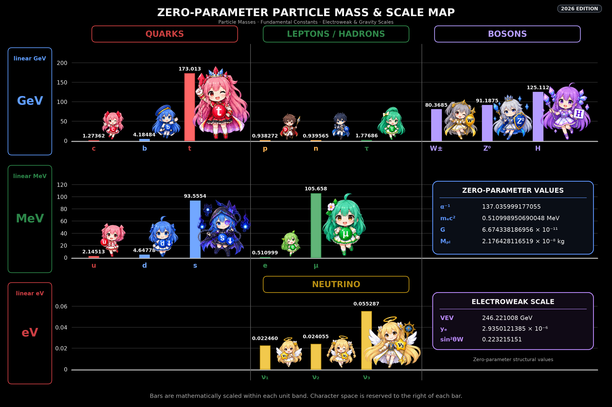

# Particle Mass Map

`particle_mass_map.py` generates the **ZERO-PARAMETER PARTICLE MASS & SCALE MAP** from the calculation modules in `core/`.

The plotting script does not maintain a separate set of physical prediction values. Particle masses, electroweak quantities, and gravity-related values are calculated from the repository's `core/` modules at runtime and then passed to the renderer.

## Output example

The current 2026 edition generated by `particle_mass_map.py`:



The image above is generated from the calculation results supplied by `core/`; it is not a manually maintained table of prediction values.

## Overview

The tool produces a black-background particle mass map containing:

- quark masses
- charged-lepton masses
- proton and neutron masses
- neutrino masses
- W, Z, and Higgs masses
- inverse fine-structure constant `α⁻¹`
- electron rest energy `mₑc²`
- gravitational constant `G`
- Planck mass `Mₚₗ`
- electroweak VEV
- electron Yukawa coupling `yₑ`
- weak mixing quantity `sin²θW`

Mass bars are linear within each unit band:

- GeV
- MeV
- eV

Character artwork is cropped from a supplied **1536 × 1024** black-background character sheet and composited onto the generated chart.

No generative image AI is used by this tool.


> This README is intended to be stored as `tools/README.md`.  
> The output-image link above assumes `zero_parameter_particle_mass_scale_map_2026.png` is stored in the same `tools/` directory.

## Repository layout

Recommended placement:

```text
zero-parameter-structure/
├─ core/
│  ├─ structural_constants.py
│  ├─ structural_electron.py
│  ├─ structural_gravity.py
│  ├─ structural_higgs_electroweak.py
│  ├─ structural_neutrino.py
│  └─ structural_quark_mass.py
│
└─ tools/
   ├─ README.md
   ├─ particle_mass_map.py
   ├─ character_sheet.png
   └─ zero_parameter_particle_mass_scale_map_2026.png
```

`particle_mass_map.py` automatically searches for the repository root by locating:

```text
core/structural_constants.py
```

The script can therefore be placed either:

- in the repository root, or
- in `tools/`

## Requirements

Python 3.10 or later is recommended.

Required Python packages:

```bash
pip install matplotlib pillow numpy
```

Matplotlib's bundled **DejaVu Sans** font is used for Unicode symbols such as Greek letters, superscripts, and subscripts.

## Usage

From the repository root:

```bash
python tools/particle_mass_map.py \
    --characters tools/character_sheet.png \
    --output tools/zero_parameter_particle_mass_scale_map_2026.png
```

On Windows PowerShell:

```powershell
python tools/particle_mass_map.py `
    --characters tools/character_sheet.png `
    --output tools/zero_parameter_particle_mass_scale_map_2026.png
```

If `character_sheet.png` is in the current working directory, the defaults can be used:

```bash
python tools/particle_mass_map.py
```

## Command-line options

### `--characters`

Path to the source character sheet.

```bash
--characters tools/character_sheet.png
```

The current crop definitions require the source image to be exactly:

```text
1536 × 1024 px
```

### `--output`

Path of the final PNG.

```bash
--output particle_mass_map_2026.png
```

Default:

```text
zero_parameter_particle_mass_scale_map_2026.png
```

### `--keep-background`

Keep the intermediate background-only image.

```bash
python tools/particle_mass_map.py \
    --characters tools/character_sheet.png \
    --keep-background
```

Without this option, the intermediate image is deleted after the final composition is saved.

## Core integration

The renderer obtains all displayed physical quantities through:

```python
values = compute_map_values()
```

`compute_map_values()` calls the repository's existing calculation modules.

| Sector | Core module |
|---|---|
| Structural constants | `core.structural_constants` |
| Electron / charged-particle sector | `core.structural_electron` |
| Quark masses | `core.structural_quark_mass` |
| Neutrino masses | `core.structural_neutrino` |
| Higgs / electroweak sector | `core.structural_higgs_electroweak` |
| Gravity sector | `core.structural_gravity` |

The renderer therefore acts as a visualization layer rather than an independent calculation implementation.

The intended data flow is:

```text
core structural formulas
        ↓
compute_map_values()
        ↓
Decimal calculation results
        ↓
Matplotlib / Pillow rendering boundary
        ↓
particle_mass_map_2026.png
```

`Decimal` values are preserved during calculation. Conversion to `float` occurs only where Matplotlib requires floating-point plotting geometry.

## Render resolution

The base logical canvas is:

```text
1536 × 1024
```

Resolution is controlled by:

```python
RENDER_SCALE = 2
```

Available examples:

```python
RENDER_SCALE = 1   # 1536 × 1024
RENDER_SCALE = 2   # 3072 × 2048
RENDER_SCALE = 4   # 6144 × 4096
```

Layout coordinates remain in the original **1536 × 1024 logical coordinate system**. Do not manually double character positions or box coordinates when increasing `RENDER_SCALE`.

## Character placement

Character extraction and placement are controlled by:

```python
CHAR_CROPS
Y_TARGETS
CHAR_SCALE_BOX_W
CHAR_ANCHOR
CHAR_DX
SCALE_FACTORS
```

### `CHAR_CROPS`

Defines crop rectangles in the original 1536 × 1024 character sheet.

Format:

```python
"name": (left, top, right, bottom)
```

### `Y_TARGETS`

Defines the vertical placement range of each character.

### `CHAR_ANCHOR`

Associates each character with one of the three horizontal groups:

```text
Q = quark group
L = lepton / hadron group
B = boson group
```

and a slot index:

```text
0, 1, 2
```

### `CHAR_DX`

Applies small horizontal corrections without changing character scale.

### `SCALE_FACTORS`

Applies per-character visual scale adjustments.

Character scaling is intentionally independent of the calculated bar geometry.

## Plot structure

The chart uses three independent linear mass bands:

```text
GeV
MeV
eV
```

The horizontal group geometry follows a shared slot model:

```text
slot = bar width + reserved character width
group = 3 slots
```

with a fixed gap between:

```text
QUARKS | LEPTONS / HADRONS | BOSONS
```

The neutrino row uses the lepton-group slots and is labeled separately as `NEUTRINO`.

## Character-sheet handling

The current edition is designed for a **black-background character sheet**.

Black pixels are deliberately preserved:

```python
return sheet.crop(box).convert("RGBA")
```

No black-to-transparent conversion is performed. This prevents facial details such as eyebrows, pupils, outlines, and dark hair details from being removed.

Because the final chart background is also black, the rectangular crop background blends into the final composition.

## Output pipeline

The rendering sequence is:

1. Calculate values from `core/`.
2. Render the Matplotlib mass-bar background.
3. Crop characters from `character_sheet.png`.
4. Resize and place character sprites.
5. Draw structural-value information boxes with Pillow.
6. Draw the final title, subtitle, and edition badge.
7. Save the final PNG.

## Design principle

`particle_mass_map.py` should contain:

- visualization logic
- layout coordinates
- typography
- colors
- character crop and placement data
- output formatting

Physical prediction formulas and source values should remain in `core/`.

This keeps:

```text
core/   = theory and calculation
tools/  = visualization and output
```

and prevents calculation values in the figure from drifting away from the repository's canonical implementation.

## Notes

- The chart is a visualization of the repository's structural calculations.
- GeV, MeV, and eV bars are independently linear within their respective bands.
- Very small GeV-scale masses such as proton, neutron, and tau masses appear close to the GeV baseline because the same linear GeV axis also contains the top-quark mass.
- The current layout is pixel-tuned for the supplied character sheet.
- If the character-sheet dimensions or composition change, `CHAR_CROPS` and placement parameters should be recalibrated.

## License

Use the same license as the parent `zero-parameter-structure` repository unless the artwork has separate licensing terms.
